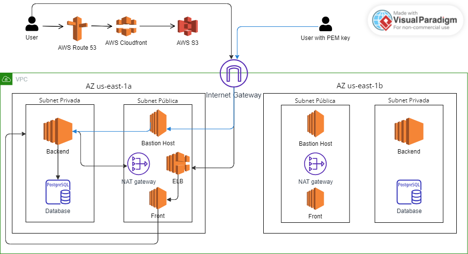

# Arquitetura Corporativa

 Fonte: autoria própria.

A arquitetura da aplicação proposta é projetada para fornecer uma aplicação escalável, de alto desempenho, segura, com tolerância a falhas e capacidade de contornar problemas como failover. O fluxo principal da aplicação é o seguinte:
O fluxo se inicia quando um usuário qualquer tenta acessar a aplicação, via internet. Esse usuário pode estar realizando o acesso por meio de qualquer cliente que queira interagir com a aplicação, seja um navegador web, um aplicativo…
Para acessar a aplicação, o usuário digita um domínio, um nome legível por humanos para identificar e acessar um site na internet, que é traduzido para um IP de máquina por meio do serviço AWS Route 53, um DNS responsável por rotear as solicitações dos usuários para os recursos da AWS.

Após essa tradução do domínio, o tráfego do usuário é direcionado para o AWS CloudFront, que é uma CDN (Content Delivery Network), que armazena em cache recursos estáticos, como imagens, scripts, arquivos css e html, em servidores espalhados pelo mundo. Assim, com esse serviço, o conteúdo é entregue ao usuário de maneira mais rápida, reduzindo a latência e melhorando a experiência do usuário.
O AWS CloudFront, no entanto, atua apenas como um intermediário para entregar os recursos de forma mais rápida e eficiente, uma vez que ele utiliza os recursos armazenados no AWS S3 como fonte de conteúdo. Ou seja, o CloudFront mantém apenas cópias temporárias em cache dos objetos para acelerar a entrega. O AWS Simple Storage Service (S3), por sua vez, armazena os objetos (imagens, documentos estáticos…) da aplicação. Esse recurso fornece escalabilidade, durabilidade e alta disponibilidade.

Após a entrega do conteúdo estático, a requisição do usuário é direcionada para o Elastic Load Balancer (ELB), que é um serviço que realiza um balanceamento de carga, direcionando o tráfego de maneira equilibrada entre as instâncias EC2 disponíveis. Isso garante que a aplicação tenha uma maior disponibilidade e desempenho, uma vez que nenhuma máquina fica sobrecarregada.
Assim, quando a requisição chega em uma instância EC2, o processamento necessário é feito, podendo ser necessário acessar a instância Postgresql do serviço de bancos de dados relacionais da AWS, o RDS, e a resposta é retornada ao usuário que realizou a requisição.

O outro fluxo da aplicação, que envolve um bastion host para acesso seguro à infraestrutura da aplicação, funciona da seguinte maneira:
O processo inicia-se quando um usuário tenta acessar a infraestrutura da aplicação. Para isso, ele precisa de uma chave PEM, uma chave privada utilizada para autorização do usuário a acessar o bastion host, que é uma instância EC2 assim como qualquer outra, só que tem como objetivo principal fornecer acesso seguro a outras instâncias da rede privada. É uma porta de entrada para possibilitar acesso aos recursos das sub-redes privadas.

Assim que o usuário se autentica no bastion host, ele utiliza a linha de comando da máquina para estabelecer uma conexão SSH com qualquer uma das instâncias da rede privada.
Ao acessar as instâncias EC2, o usuário pode alterá-las como quiser, além de, por meio dessas instâncias, conseguir acesso ao banco de dados RDS.

Dessa forma, o fluxo de acesso à infraestrutura da aplicação se torna muito mais seguro, pois as instâncias principais não são expostas a internet, mas sim uma instâncias de segurança, o bastion host, que permite o acesso às outras instâncias.

De maneira geral, essa arquitetura foi elaborada para atender a diversos requisitos importantes, compreendidos durante o processo de levantamento de requisitos realizados com o parceiro de negócios, a Stone.
Uma das propriedades essenciais dessa arquitetura é que ela possui uma estrutura de balanceamento de carga, que utiliza o Elastic Load Balancer (ELB), distribuindo o tráfego entre variâncias instâncias EC2, melhorando a disponibilidade da aplicação durante picos acesso, contexto esse passado pela Stone, promovendo o atendimento das demandas dos clientes com múltiplas máquinas. 
Além disso, para que o serviço continue funcionando, sem falhas, o ELB atua com o direcionamento do tráfego para instâncias saudáveis, em caso de alguma máquina virtual específica falhar. Paralelamente a isso, o Serviço de Banco de Dados Relacionas da AWS (RDS) também é projetado para garantir disponibilidade dos dados, mantendo o funcionamento do serviço de pé. Isso é possível pois quando configura-se uma instância de banco de dados RDS, pode-se configurar cópias do banco em zonas de disponibilidade diferentes, então quando houver falha no banco principal, o RDS modifica a outra réplica para que se torne o banco de dados primário, permitindo leitura e escrita, promovendo a continuidade da aplicação.

Como complemento, atuando na recuperação de desastres, o RDS oferece a capacidade de realização de backups automáticos e manuais, assim, é possível restaurar o banco de dados para um ponto anterior com um RTO (Recovery Time Objective) baixo. Além de que o RDS também oferece a opção de criar snapshots do banco de dados, que são como uma “foto” do banco de dados, que contém os dados armazenados em si e as configurações e estruturas do banco. 

Por fim, essa arquitetura foi elaborada a fim de garantir a escalabilidade do sistema, ou seja, sua capacidade continuar funcionando com um bom desempenho mesmo quando houver picos de acesso. Para isso, as instâncias EC2 podem ser configuradas se ajustarem automaticamente conforme a demanda, de acordo com critérios definidos, como a utilização da CPU. Desse modo, a infraestrutura dinamicamente se adapta às demandas e garante que a aplicação continue funcionando sem a necessidade de intervenção manual. Ademais, a mesma propriedade de escalabilidade se encontra no RDS, que permite dimensionamento vertical, ou seja, aumentar a capacidade do servidor do banco de dados, e dimensionamento horizontal, por meio da adição de réplicas de leitura do banco de dados.

