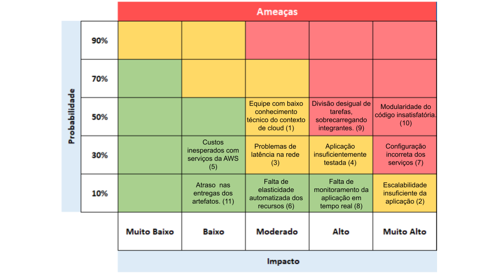

# Entendimento do Negócio

## Matriz de Oceano Azul
A Matriz de Oceano Azul é uma estratégia que visa expandir o espaço no mercado a fim de criar novas demandas, conquistando tal espaço no mercado e obtendo poder e vantagens em comparação a concorrência. Sua diferença em comparação com o Oceano Vermelho é que, ao invés de tentar apenas superar a concorrência e obter a maior parcela existente no mercado de atuação, tornando os produtos presentes em commodities, no Oceano azul é explorado o potencial em um mercado inexplorado, que não há uma competição atroz. 

O Oceano Azul denota um espaço vasto e poderoso ao se tratar de crescimento da empresa. Neste Oceano a concorrência não possui tanta relevância, o cenário tem foco na captura e criação de novas mudanças, assim como no favorecimento da diferenciação e da procura por baixo custo. Desse modo, para compreender tanto o mercado quanto o negócio o qual a empresa Stone está inserida e como a solução a ser desenvolvida contribui para a Stone neste Oceano Azul, é declarado atributos, como reduzir, eliminar, aumentar e criar, sendo:

 Fonte: autoria própria.

### Reduzir
- **Custo dos testes da aplicação:** Refere-se a utilizar recursos e opções que atribuem maior qualidade e otimização ao mesmo tempo que mantém um custo benefício.
	
- **Perda de potenciais clientes:** Refere-se a redução da probabilidade de queda da aplicação que, por consequência, gera perda de quem se interessa pelos serviços ofertados pela Stone. O objetivo é evitar que leads/potenciais clientes não tenham seu processo de se tornar um cliente oficial interrompido por falhas.
	
- **Riscos de vulnerabilidade de queda:** A queda ainda pode persistir, mas o objetivo é que o limite de capacidade o qual a aplicação aguenta se expanda para um número maior a fim de atender mais requisições do que se atende atualmente, logo, a vulnerabilidade de queda se torna menor.
	
### Aumentar
- **Escalabilidade:** O objetivo é aumentar a capacidade do sistema, para que lide com o aumento da demanda conforme o número de acessos cresce a cada segundo, mantendo o desempenho e a qualidade.

- **Número de requisições:** O objetivo é aumentar a capacidade de requisições que o sistema apresenta, para evitar que a aplicação não tenha solicitações de clientes perdidas. 

- **Velocidade de resposta:** A velocidade de resposta trata-se do tempo de resposta que a aplicação apresenta, o objetivo é que esse tempo seja o mínimo possível para não prejudicar a experiência do usuário.
	
- **Interface amigável:** Muitos clientes podem apresentar dificuldades ao interagir com a interface. Desenvolver uma interface mais intuitiva, acessível e amigável pode facilitar ainda mais a ação e interação com os recursos existentes.
	
### Criar
- **Testes de segurança:** Atualmente o sistema não possui testes de segurança para verificar vulnerabilidades potenciais.
	
- **Histórico das métricas de testes:**	Refere-se à avaliação das métricas em relação ao desempenho e outros aspectos relevantes do sistema ao longo do tempo. Este histórico das métricas de testes também não é existente atualmente.

Também foram estipulados valores aos atributos em comparação com a aplicação atual da Stone e com a aplicação a ser atendida, estes valores vão de 0 a 10. Estes valores foram atribuídos de acordo com a análise e visão do time, sendo alinhado às expectativas da Stone em relação à solução a ser desenvolvida.

| Atributos                           | Solução atual | Solução desenvolvida |
|-------------------------------------|---------------|----------------------|
| Custo dos testes da aplicação       | 4             | 3                    |
| Perda de potenciais clientes        | 4             | 2                    |
| Riscos de vulnerabilidade de queda  | 4             | 2                    |
| Escalabilidade                      | 3             | 8                    |
| Número de requisições               | 4             | 10                   |
| Velocidade de resposta              | 6             | 10                   |
| Interface amigável                  | 7             | 9                    |
| Testes de segurança                 | 0             | 9                    |
| Histórico das métricas de testes     | 0             | 10                   |

Abaixo há projeção de um gráfico representando a comparação entre a solução atual, representada pela cor azul e a solução a ser desenvolvida, representada pela cor amarela:

Fonte: autoria própria.

## Matriz de Risco

A Matriz de Risco é uma ferramenta utilizada para avaliar e gerenciar os riscos em um projeto. A ideia dessa técnica é representar graficamente os riscos mapeados para determinado projeto e classificá-los de acordo com a sua probabilidade de ocorrência e impacto ao desenvolvimento. É uma ferramenta importante para ajudar as empresas a identificar e gerenciar os riscos de forma eficaz, o que é fundamental para o sucesso dos produtos e da realização de projetos de maneira segura e bem-sucedida, trazendo a possibilidade de identificar e priorizar os riscos mais críticos e, por consequência, desenvolver estratégias para minimizar seu impacto..

 Fonte: autoria própria.

 Fonte: autoria própria.

## Justificativa dos riscos e oportunidades

(1): O fato da equipe não possuir experiência com computação em nuvem pode levar a perda de tempo desnecessária e uma dificuldade maior, ou até mesmo a impossibilidade, de desenvolvimento da solução.  
(2): Caso o dimensionamento de recursos seja feito de maneira incorreta, o sistema pode não conseguir ser escalável o suficiente para aguentar picos de acessos, levando a falhas.  
(3): Se a rede não estiver bem construída, o sistema pode sofrer com uma latência alta, prejudicando a experiência do usuário, promovendo a insatisfação desses.  
(4): Sem rigorosidade nos testes de carga, não será possível testar a real eficiência da estrutura criada, o que poderia causar falhas no sistema durante o real momento de estresse.  
(5): Se não existir um monitoramento adequado dos custos de cada serviço da AWS utilizado, como instâncias EC2 e serviços de armazenamento, o projeto pode acabar custando mais caro do que deveria.  
(6): Caso a estrutura não seja elástica o suficiente para adaptar o quanto de cada recurso deve ser utilizado, pode ocorrer sobrecarga ou subutilização de recursos.  
(7): Se a configuração dos serviços não for feita adequadamente e não for rigorosa com as configurações de segurança, a aplicação pode se tornar vulnerável e impedida de ser utilizada.  
(8): Se não for criada uma estrutura de monitoramento eficaz e que permita o acompanhamento de indicadores como uso da CPU das máquinas, requisições atendidas x não atendidas, não será possível mitigar os riscos e resolver problemas urgentes na aplicação.  
(9): A divisão desigual de tarefas pode levar a uma diminuição da eficiência, aumento do estresse e possíveis atrasos na conclusão das atividades.  
(10): Isso dificulta a manutenção, reutilização e escalabilidade do código, podendo levar a atrasos no desenvolvimento, aumento da complexidade e dificuldade de entendimento do código.  
(11): O atraso das entregas leva ao atraso do desenvolvimento do projeto como um todo, além de causar conflitos no grupo.  
(12): Ao trabalhar todos os dias em equipe para solucionar o problema conseguiremos desenvolver nossas habilidades interpessoais.  
(13): Como usaremos o git no dia a dia do projeto, aprimorarmos nossas habilidades com essa ferramenta que é essencial.  

## Canvas Proposta de Valor 
De acordo com os requisitos levantados e com o entendimento do problema, foram elaborados dois canvas de proposta de valor, um referente ao sistema/ambiente de testes de carga e outro à aplicação genérica desenvolvida, no caso, um marketplace de pedras preciosas, respectivamente:

 Fonte: autoria própria.

 Fonte: autoria própria.

## Análise financeira do projeto

A busca por expansão e inovação muitas vezes requer uma análise financeira abrangente para avaliar o potencial impacto nos resultados e na sustentabilidade de uma empresa. Neste relatório, apresentamos uma análise financeira baseada em dados hipotéticos e estimados, considerando a implementação de uma aplicação AWS para a empresa parceira. Este projeto visa fornecer uma visão detalhada dos possíveis custos, receitas e implicações financeiras associadas à iniciativa.

### Custos
Para entender o panorama financeiro, examinamos os diferentes aspectos de custos envolvidos na implementação da aplicação AWS. Os custos são divididos em três categorias principais: infraestrutura, desenvolvimento e operação/manutenção. Esses valores estimados incluem gastos com servidores, rede, armazenamento, desenvolvimento do site, testes de stress, suporte e manutenção, bem como licenças de software. Os custos iniciais são estimados em $120.000, enquanto os custos mensais recorrentes totalizam cerca de $83.000.

- Infraestrutura
    - Servidores: $50.000 por mês
    - Rede: $10.000 por mês
    - Armazenamento: $5.000 por mês

- Desenvolvimento
    - Desenvolvimento do Site: $100.000 (custo único)
    - Testes de Stress: $20.000 (custo único)

- Operação e Manutenção
    - Suporte e Manutenção: $15.000 por mês
    - Licenças de Software: $3.000 por mês

Total de Custos Iniciais: $120.000  
Total de Custos Mensais: $83.000  
Custo Total no Primeiro Ano: $120.000 (inicial) + $83.000 * 12 (mensal) = $1.116.000  
Receita Total no Primeiro Ano: $0  
Lucro/Prejuízo no Primeiro Ano: $0 - $1.116.000 = -$1.116.000

### Receitas

Por ser um sistema de uso interno da empresa, não se aplicam receitas relacionadas à aplicação/ambiente de testes.

### Conclusão da análise financeira

1. Viabilidade Financeira
Com um prejuízo de $1.116.000 no primeiro ano e sem fontes de receita identificadas, o projeto enfrenta sérios desafios de viabilidade financeira. Isso significa que, sem mudanças significativas no modelo de negócios ou na estrutura de custos, o projeto não seria capaz de sustentar-se financeiramente.

2. Necessidade de Investimento Inicial
O investimento inicial de $120.000 e os custos mensais contínuos de $83.000 representam um compromisso financeiro substancial. Sem receitas para compensar esses custos, seria necessário um financiamento significativo para lançar e manter o projeto.

3. Riscos e Incertezas
A ausência de receitas aumenta os riscos e incertezas associados ao projeto. Sem uma clara trajetória para o retorno do investimento, os investidores e partes interessadas podem ser relutantes em apoiar o projeto.
