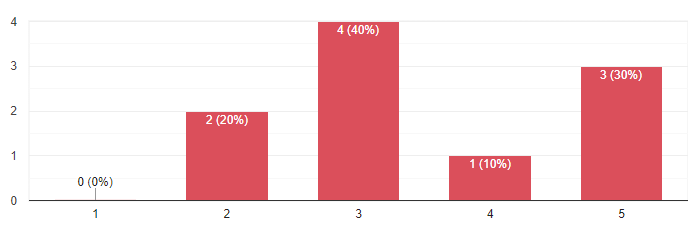

# Entendimento do usuário

Neste relatório são apresentados os resultados e as metodologias da pesquisa realizada, que se divide em três partes - pesquisa exploratória, pesquisa desk e pesquisa qualiquantitativa. Essa etapa de descobrimento e investigação tem como principais objetivos:
- Compreensão do contexto geral do projeto, ou seja, como surgiu essa demanda;
- Resultados esperados com a aplicação requisitada;
- Principais envolvidos e impactados pela aplicação;
- Entendimento da Stone - produtos centrais oferecidos pela empresa, posicionamento desta no mercado, principais gargalos…; e
- Requisitos cruciais do sistema a ser desenvolvido.

A justificativa para esta pesquisa reside na necessidade de embasar o entendimento do grupo sobre os requisitos e desafios do projeto apresentado, além do entendimento do contexto do usuário no sistema. Diante da complexidade e da importância da aplicação a ser desenvolvida, é essencial que a compreensão acerca dessa seja profunda e correta, garantindo que todos os integrantes do grupo tenham um entendimento detalhado dos objetivos e requisitos principais. 

Dessa maneira, é possível progredir de modo mais eficaz rumo ao desenvolvimento de uma solução que atenda aos [requisitos funcionais e não funcionais](./requisitos.md) esperados e que abranja as [considerações de negócios](./entendimento_negocio.md) propostas pela Stone.

## Pesquisa exploratória
A pesquisa exploratória teve como objetivo a compreensão do assunto que será trabalhado na resolução do problema. Essa pesquisa se deu basicamente em duas etapas principais: estudo do TAPI,  documento que possui informações relevantes sobre o projeto, e um workshop com três representantes da Stone, sendo dois da área técnica e um da área de negócios.

Ao examinar o TAPI, foi possível obter uma compreensão geral do projeto, tanto em relação a aspectos técnicos quanto em relação a aspectos de negócios. Ou seja, conseguiu-se definir os objetivos da solução, recursos e restrições envolvidos no desenvolvimento do sistema, usuários, infraestrutura e arquitetura que será construída, além de compreender quais são os stakeholders do projeto e os ganhos que serão obtidos.

Na segunda etapa da pesquisa exploratória foi possível obter um entendimento do projeto mais aprofundado, resultando em diversos insights e na consolidação de conhecimentos que serão utilizados adiante, no processo de desenvolvimento da aplicação. Durante o workshop, foi alcançado o entendimento mais concreto acerca das funcionalidades que o sistema deve possuir além da infraestrutura que deve ser criada para suportá-lo. Discutiram-se aspectos como: expectativas de segurança para a aplicação, quais indicadores essenciais de serem observados sobre o sistema, escalabilidade da solução, ferramentas a serem utilizadas (K6, Kubernetes, Grafana e serviços da AWS), além de possíveis gargalos que serão enfrentados na aplicação. 

Em resumo, por meio do TAPI alcançou-se um entendimento mais geral do projeto e do sistema requisitado e, durante o workshop, foi possível obter informações técnicas mais detalhadas diretamente com os representantes da Stone. Ao final dessa etapa de pesquisa exploratória, ficou claro a todos integrantes do grupo os requisitos necessários e o contexto geral da aplicação.

## Pesquisa desk

Nesta seção, é apresentado um resumo dos dados coletados durante a primeira sprint do desenvolvimento do projeto. Isso inclui informações relevantes coletadas no TAPI, em entrevistas com o parceiro, e em fontes secundárias, como artigos e relatórios.

A informação inicial coletada veio do TAPI. Lá é possível ter uma visão macro de como deve ser desenvolvido o projeto. O projeto baseia-se em três entregáveis:

- **Implementação de uma Aplicação web**
    - É necessário desenvolver uma aplicação altamente performática e escalável, garantindo sua disponibilidade contínua. A arquitetura escolhida envolve a distribuição da aplicação em diversos componentes, todos implantados em um ambiente de nuvem usando um cluster Kubernetes. Para assegurar a qualidade, todos os componentes e imagens da aplicação passarão por rigorosos testes de autenticação, avaliando sua capacidade de proporcionar um desempenho adequado e estar sempre disponível. A aplicação precisa atender a requisitos específicos, que serão abordados em detalhes.

- **Implementação de um sistema de testes da aplicação web**
    - Será necessário criar um sistema independente da aplicação, dedicado à realização de testes que avaliem a disponibilidade, tempo de resposta, capacidade de carga e resistência ao estresse. Para essa finalidade, a ferramenta K6 será empregada, juntamente com os serviços de monitoramento em nuvem. Cada componente individual da aplicação requer um conjunto específico de testes para garantir seu funcionamento ideal. O foco dessas análises é direcionado para a equipe responsável pela operação contínua da aplicação.

- **Utilização do GitHub Actions**
    - A implementação e configuração do desenvolvimento serão realizadas através de ações no GitHub Actions, utilizando o mesmo runner para assegurar a uniformidade e repetibilidade do processo de Integração Contínua e Entrega Contínua (CI/CD).

- **Análise de Responsividade e Uso de Recursos**
    - A análise dos resultados deve ser conduzida por meio de um dashboard no Grafana, o qual permitirá a visualização em tempo real dos indicadores de desempenho do sistema. Paralelamente, a análise de logs será realizada para identificar potenciais erros ou áreas de aprimoramento no sistema. Os principais indicadores avaliados serão:
        - A taxa de atendimento de requisições bem-sucedidas e falhas, apresentada como um percentual do total. Essa métrica proporcionará uma avaliação da capacidade do sistema em lidar com cargas elevadas de requisições, garantindo sua robustez e confiabilidade.
        - A alocação de recursos em diferentes estágios: antes, durante e após os momentos de pico de demanda. Essa métrica será crucial para avaliar a eficiência do sistema quanto à utilização de recursos, bem como sua habilidade de escalonar de forma eficaz em resposta à variação de demanda.

Além disso, em entrevistas com o parceiro, foram identificadas as principais necessidades e expectativas em relação ao produto final:
- **O sistema deve ser capaz de originar 35.000 requisições por segundo;**
    - Devido ao alto número de requisições ao site do parceiro nos dias de provas do BBB, o novo serviço deve ser capaz de originar 35.000 requisições por segundo, assim, impedindo que ele caia.
- **O sistema deve ser escalável e resiliente;**
    - O parceiro tem a necessidade de possuir um sistema escalável, visto que, deixando um número alto de possíveis requisições a todo o momento gera preços exuberantes.
- **Deve haver um sistema para testes da aplicação;**
    - Para verificar o funcionamento, a consistência e a segurança, da aplicação, devem ser realizados testes para encontrar os limites da aplicação, e verificar se ela está atendendo aos requisitos.
- **O sistema deve contemplar um meio de monitoração com o histórico de métrica dos testes;**
    - Para uma monitoração contínua e melhor controle, os testes devem ser registrados, e salvos em um histórico do qual o parceiro terá acesso.
- **O processo de teste deve ser econômico.**
    - Para evitar altos gastos com testes, todo o sistema de testes deve ser econômico, isto é, evitar despesas desnecessárias.

## Pesquisa qualiquantitativa

Como terceiro passo de pesquisas de entendimento do usuário, foi aplicada uma pesquisa qualiquantitativa utilizando o método "bola de neve", que consite em fazer rodadas de entrevistas e, logo em seguida, realizar novamente as entrevista com candidatos indicados pelos participantes da rodada anterior.

Como não havia tempo hábil suficiente para contatar os próprios usuários do sistema, foram elaboradas perguntas genéricas aplicadas a um público geral, porém que se encaixavam no contexto da aplicação a ser desenvolvida. Ao invés de entrevistas propriamente ditas, um formulário online foi utilizado para coletar respostas e realizar as rodadas do método. A seguir constam as questões abordadas:

1. Você se considera uma pessoa que utiliza muitos atalhos de teclado quando está navegando pelo computador?
    
    Fonte: autoria própria.

    Alternativas de repostas: escala de 1 a 5, onde 1 refere-se a 'Uso pouco' e 5 'Uso bastante'.

2. Em uma escala de 1 a 5, sendo 5 extremamente irritado, como você se sente quando você está navegando em um site e se depara com uma tela de carregamento? Considere que a tela demora mais de 5 segundos para ser redirecionada.

    
    Fonte: autoria própria

3. Em questão de experiência, o que mais impacta você positivamente ao usar um site? Cite duas ou mais características.
    - As respostas foram em formato de caixa de texto abertas, com as seguintes ocorrências mais frequentes:
        - Velocidade e rapidez;
        - Experiência de usuário e navegabilidade;
        - Design atraente

4. Você é mais atraído por sites que oferecem informações de maneira generalista/resumida, que apresentam conteúdos detalhados ou que apresentam as duas opções? Por quê?
    - As respostas foram em formato de caixa de texto abertas, com resultados bastante equilibrados. Com base neles, é seguro concluir que uma exposição de dados equilibrada, com ambos resumos e informações detalhadas, é o ideal.

5. Para você, quais sinais são indicativos de confiabilidade de dados de um site? Como sabe que são verdadeiros e o que te deixa com mais certeza disso?
    - As respostas foram em formato de caixa de texto abertas. Os resultados se diferem bastante de pessoa para pessoa, com as principais ocorrências sendo:
        - Top #1 nas pesquisas do Google;
        - Qualidade do conteúdo;
        - Qualidade de design;
        - Avaliações do site;
        - Sem erros de gramática;
        - URL do site.

## Conclusão

Após percorrer o processo de imersão, obteve-se uma visão mais clara e aprofundada do projeto, como um todo. Por meio da análise do TAPI, do workshop com representantes da Stone e com pesquisas do grupo, foi possível adquirir uma compreensão global do problema e de como resolvê-lo da maneira mais eficaz, considerando os requisitos do parceiro.

Além disso, a pesquisa qualiquantitativa e as interações com o parceiro de negócios permitiram, também, entender melhor a perspectiva do usuário final. Desse modo, o grupo consegue desenvolver esforços não apenas buscando o atendimento aos requisitos e a eficácia técnica, mas também a satisfação e a utilidade para aqueles que utilizarão a aplicação, uma vez que seus comportamentos e modos de interação foram mapeados com esses estudos prévios.
    
Com os dados coletados pelas pesquisas e com as análises feitas, foi possível montar uma Matriz de Figuras, a fim de mapear o usuário:

Dessa maneira, conclui-se que esse processo de imersão foi essencial para consolidar o entendimento técnico e de negócios do problema, além de entender sobre o usuário. Assim, permitindo que consigamos realizar um planejamento do desenvolvimento da solução de maneira muito mais precisa e com embasamento sólido para a abordagem adotada.

