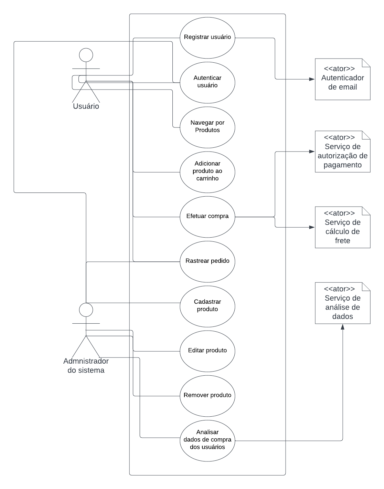
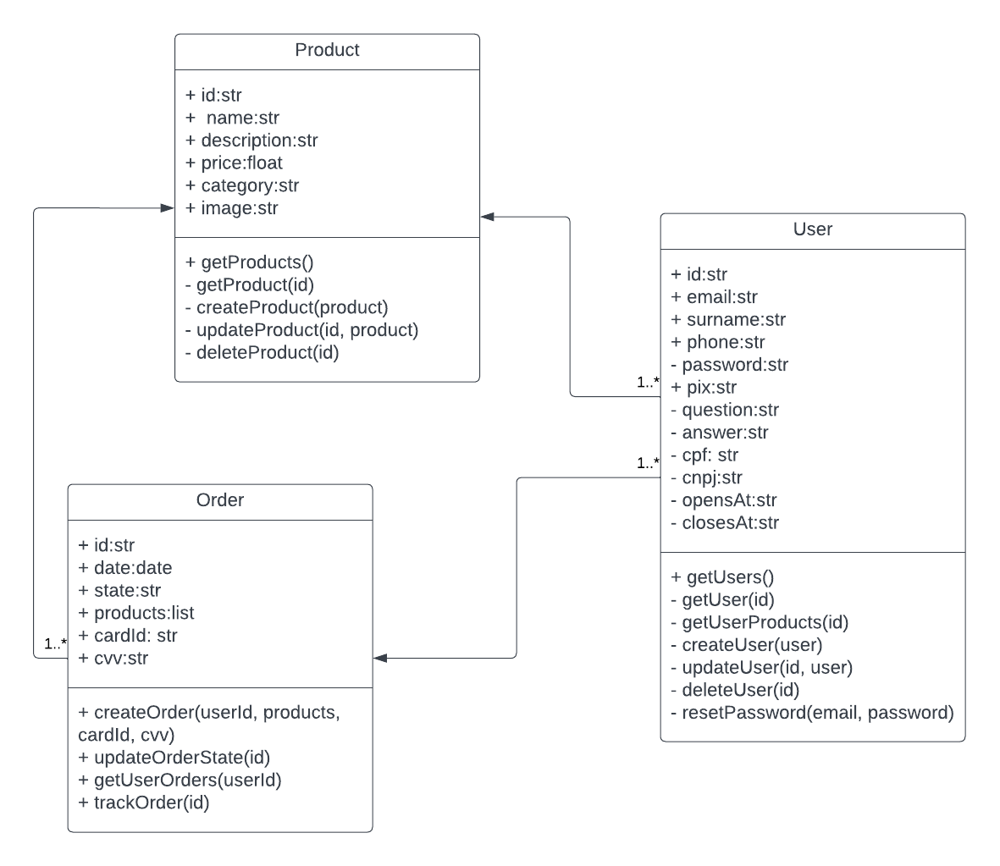
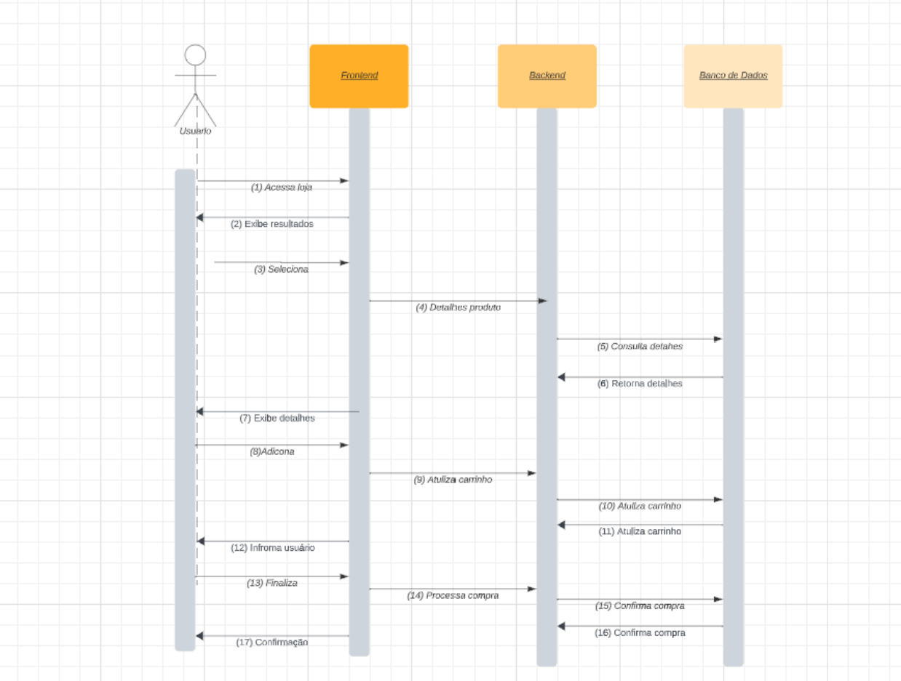
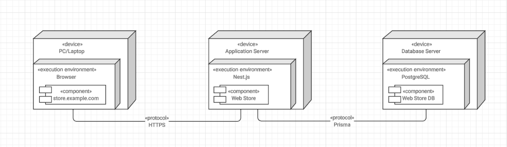

# Modelagem e Implementação

## Diagrama de Casos de Uso

O diagrama de casos de uso é uma representação visual usada para ilustrar como os atores (usuários ou sistemas externos) interagem com o sistema em desenvolvimento. No contexto de projeto, ele descreve as principais funcionalidades do sistema, como registro de usuários, busca de produtos, compras e gerenciamento de pedidos. Cada funcionalidade é representada como um "caso de uso," e os atores externos são identificados como entidades que interagem com o sistema.

 Fonte: autoria própria.

Caso de Uso: Registrar Usuário
Escopo: Sistema de compra de produtos da Stone
Nível: Funcionalidade Principal
Atores: Usuário, Serviço de autenticação de email
Interessados e Interesses:
Usuário: Deseja se registrar na plataforma para efetuar compras.
Pré-condições: O usuário acessa a página de registro.
Pós-condições: O usuário é registrado no sistema e pode efetuar login.
Fluxo Básico:
1. O usuário acessa a página de registro.
2. O usuário insere suas informações cadastrais
3. O sistema valida os dados e registra o usuário.
4. O sistema exibe uma mensagem de confirmação de registro.
Fluxos Alternativos:
3a. Se os dados inseridos pelo usuário não forem válidos, o sistema exibe uma mensagem de erro e retorna ao passo 2.
Requisitos Especiais: -
Lista de Variantes: -
Frequência de Ocorrência: Alta
Problemas em Aberto: -

Caso de Uso: Autenticar Usuário
Escopo: Sistema de compra de produtos da Stone
Nível: Funcionalidade Principal
Atores: Usuário
Interessados e Interesses:
Usuário: Deseja fazer login para acessar sua conta.
Pré-condições: O usuário acessa a página de login.
Pós-condições: O usuário autenticado tem acesso à sua conta.
Fluxo Básico:
1. O usuário acessa a página de login.
2. O usuário insere suas credenciais de login e senha.
3. O sistema valida as credenciais.
4. O sistema redireciona o usuário para a página principal logado.
Fluxos Alternativos:
3a. Se as credenciais inseridas pelo usuário não forem válidas, o sistema exibe uma mensagem de erro e retorna ao passo 2.
Requisitos Especiais: -
Lista de Variantes: -
Frequência de Ocorrência: Alta
Problemas em Aberto: -

Caso de Uso: Navegar por Produtos
Escopo: Sistema de compra de produtos da Stone
Nível: Funcionalidade Principal
Atores: Usuário
Interessados e Interesses:
Usuário: Deseja visualizar os produtos disponíveis para compra.
Pré-condições: O usuário está autenticado no sistema.
Pós-condições: O usuário visualiza a lista de produtos.
Fluxo Básico:
1. O usuário acessa a página de listagem de produtos.
2. O sistema exibe a lista de produtos disponíveis.
Fluxos Alternativos: -
Requisitos Especiais: -
Lista de Variantes: -
Frequência de Ocorrência: Alta
Problemas em Aberto: -

Caso de Uso: Efetuar Compra
Escopo: Sistema de compra de produtos da Stone
Nível: Funcionalidade Principal
Atores: Usuário, Serviço de Pagamento, Serviço de Cálculo de Frete
Interessados e Interesses:
Usuário: Deseja finalizar a compra dos produtos no carrinho.
Pré-condições: O usuário está autenticado no sistema e possui produtos no carrinho.
Pós-condições: A compra é concluída e o pedido é registrado no sistema.
Fluxo Básico:
1. O usuário acessa o produto desejado
2. O usuário insere seus dados bancários (número do cartão de crédito, CVV).
3. O sistema valida os dados de pagamento.
4. O sistema registra o pedido e atualiza o estoque de produtos.
5. O sistema exibe uma mensagem de confirmação da compra.
Fluxos Alternativos:
4a. Se os dados de pagamento inseridos pelo usuário não forem válidos, o sistema exibe uma mensagem de erro e retorna ao passo 3.
Requisitos Especiais: -
Lista de Variantes: -
Frequência de Ocorrência: Média
Problemas em Aberto: -

Caso de Uso: Rastrear Pedido
Escopo: Sistema de compra de produtos da Stone
Nível: Funcionalidade Principal
Atores: Usuário, Administrador do Sistema
Interessados e Interesses:
Usuário: Deseja rastrear o status de um pedido feito anteriormente.
Pré-condições: O usuário está autenticado no sistema e possui pedidos anteriores. Ou o administrador está logado e possui o id de um pedido.
Pós-condições: O usuário/admnistrador visualiza o status do pedido.
Fluxo Básico:
1. O usuário acessa a página de rastreamento de pedidos.
2. O usuário insere o número de identificação do pedido.
3. O sistema recupera e exibe o status do pedido.
Fluxos Alternativos: -
Requisitos Especiais: -
Lista de Variantes: -
Frequência de Ocorrência: Baixa
Problemas em Aberto: -

Caso de Uso: Cadastrar Produto
Escopo: Sistema de compra de produtos da Stone
Nível: Funcionalidade Principal
Atores: Administrador do Sistema
Interessados e Interesses:
Administrador do Sistema: Deseja cadastrar produtos para venda no sistema.
Pré-condições: O administrador está autenticado no sistema.
Pós-condições: Um novo produto é cadastrado no sistema.
Fluxo Básico:
1. O administrador acessa a página de cadastro de produto.
2. O administrador preenche os detalhes do produto, incluindo nome, descrição, preço, categoria e imagem.
3. O sistema valida os dados do produto.
4. O sistema registra o novo produto no sistema.
5. O sistema exibe uma mensagem de confirmação do cadastro do produto.
Fluxos Alternativos:
3a. Se os dados do produto não forem válidos, o sistema exibe uma mensagem de erro e retorna ao passo 2.
Requisitos Especiais: -
Lista de Variantes: -
Frequência de Ocorrência: Média
Problemas em Aberto: -

Caso de Uso: Editar Produto
Escopo: Sistema de compra de produtos da Stone
Nível: Funcionalidade Principal
Atores: Administrador do Sistema
Interessados e Interesses:
Administrador: Deseja editar informações de um produto cadastrado por ele.
Pré-condições: O administrador está autenticado no sistema e possui produtos cadastrados.
Pós-condições: As informações do produto são atualizadas no sistema.
Fluxo Básico:
1. O administrador acessa a lista de produtos cadastrados por ele.
2. O administrador seleciona o produto que deseja editar.
3. O sistema exibe um formulário de edição com os detalhes do produto.
4. O administrador faz as edições necessárias nos detalhes do produto.
5. O sistema valida os dados do produto editado.
6. O sistema atualiza as informações do produto no sistema.
7. O sistema exibe uma mensagem de confirmação da edição do produto.
Fluxos Alternativos:
5a. Se os dados editados não forem válidos, o sistema exibe uma mensagem de erro e retorna ao passo 4.
Requisitos Especiais: -
Lista de Variantes: -
Frequência de Ocorrência: Média
Problemas em Aberto: -

Caso de Uso: Remover Produto
Escopo: Sistema de compra de produtos da Stone
Nível: Funcionalidade Principal
Atores: Administrador do Sistema
Interessados e Interesses:
Usuário: Deseja remover um produto cadastrado por ele.
Pré-condições: O administrador está autenticado no sistema e possui produtos cadastrados.
Pós-condições: O produto é removido do sistema.
Fluxo Básico:
O administrador acessa a lista de produtos cadastrados por ele.
O administrador seleciona o produto que deseja remover.
O sistema exibe uma confirmação da remoção do produto.
O administrador confirma a remoção do produto.
O sistema remove o produto do sistema.
O sistema exibe uma mensagem de confirmação da remoção do produto.
Fluxos Alternativos:
4a. O administrador cancela a remoção do produto e retorna ao passo 1.
Requisitos Especiais: -
Lista de Variantes: -
Frequência de Ocorrência: Baixa
Problemas em Aberto: -

## Diagrama de Classes

 Fonte: autoria própria.

O diagrama de classes é uma representação visual fundamental no desenvolvimento de software, que descreve as classes, seus atributos e métodos, bem como as relações entre elas. Nesse contexto, realizou-se o diagrama de classes da loja online da Stone, que compreende as classes User (Usuário), Product (Produto) e Order (Pedido). 
Este sistema foi projetado para permitir que os usuários se cadastrem, listem produtos, façam pedidos e rastreiem suas compras, ou ainda que, usuários administradores possam cadastrar novos produtos e gerenciar os produtos já existentes.
Cada uma das classes pode ser descrita da seguinte forma:
- Classe User (Usuário): A classe User representa os usuários do sistema. Ela possui atributos como id, email, surname, phone, pix e outros, que armazenam informações pessoais e de contato dos usuários. Além disso, contém métodos públicos para listar todos os usuários, recuperar detalhes de um usuário específico, listar produtos cadastrados por um usuário, criar um novo usuário, atualizar informações do usuário, excluir um usuário e redefinir a senha.

- Classe Product (Produto): A classe Product é responsável pela representação dos produtos disponíveis no sistema. Seus atributos incluem id, name, description, price, category, image e outros, que descrevem detalhes do produto, como nome, descrição, preço e categoria. Os métodos públicos permitem listar todos os produtos, recuperar informações de um produto específico, listar categorias de produtos, filtrar produtos por categoria, e adicionar, atualizar e excluir produtos.

- Classe Order (Pedido): A classe Order gerencia os pedidos feitos pelos usuários. Ela possui atributos como id, date, state, products (lista dos produtos vinculados ao pedido), cardId e cvv, que armazenam informações sobre o pedido, incluindo a data, o estado, os produtos e os detalhes de pagamento. Os métodos públicos permitem criar um novo pedido, atualizar o estado de um pedido, listar pedidos feitos por um usuário e rastrear um pedido específico.

Desse modo, este diagrama de classes oferece uma visão do sistema da Stone, identificando as principais classes, seus atributos e métodos, bem como as relações entre elas.

## Diagrama de Sequência

 Fonte: autoria própria.

## Descrição Diagrama:

1. O usuário acessa a lojinha através do Frontend.
2. O Backend envia os resultados ao Frontend, que exibe para o usuário.
3. O usuário seleciona um produto da lista.
4. O Frontend solicita os detalhes deste produto ao Backend.
5. O Backend consulta o Banco de Dados para obter os detalhes.
6. O Banco de Dados retorna os detalhes do produto ao Backend.
7. O Backend envia os detalhes ao Frontend, que exibe para o usuário.
8. O usuário decide adicionar o produto ao seu carrinho.
9. O Frontend envia a solicitação de atualização do carrinho ao Backend.
10. O Backend solicita ao Banco de Dados a atualização do carrinho.
11. O Banco de Dados atualiza o carrinho e retorna a confirmação ao Backend.
12. O Backend informa ao Frontend que o produto foi adicionado, e o Frontend informa ao usuário.
13. O usuário decide finalizar a compra.
14. O Frontend envia a solicitação de processamento da compra ao Backend.
15. O Backend solicita ao Banco de Dados a confirmação do pedido.
16. O Banco de Dados confirma a compra e retorna ao Backend.
17. O Backend envia a confirmação ao Frontend, que exibe para o usuário.

## Diagrama de Implantação

 Fonte: autoria própria.

## Descrição do Diagrama:

Servidor de Aplicação: Este é o servidor central onde a aplicação principal está hospedada. Ele serve como ponto de acesso para os usuários finais e também como intermediário entre o cliente e o banco de dados.

Aplicação Web: Hospedada dentro do Servidor de Aplicação, esta é a interface principal com a qual os usuários interagem. Ela é responsável por processar as solicitações dos usuários, interagir com o banco de dados e retornar as informações solicitadas.

Client (Dispositivo do Usuário): Estes são os dispositivos dos usuários finais, como computadores, smartphones ou tablets. Eles acessam diretamente a "Aplicação Web" hospedada no Servidor de Aplicação. A comunicação entre o Client e a Aplicação Web é bidirecional, permitindo que os usuários enviem solicitações e recebam respostas.

Servidor de Banco de Dados: Este é um servidor dedicado que hospeda o "Banco de Dados". Ele é responsável por armazenar todas as informações persistentes relacionadas à aplicação.

Banco de Dados: Localizado dentro do Servidor de Banco de Dados, é o repositório central de informações. A "Aplicação Web" no Servidor de Aplicação se comunica diretamente com este Banco de Dados sempre que precisa recuperar ou armazenar informações. Esta comunicação é bidirecional, permitindo que a Aplicação Web faça consultas e também insira ou atualize dados.

