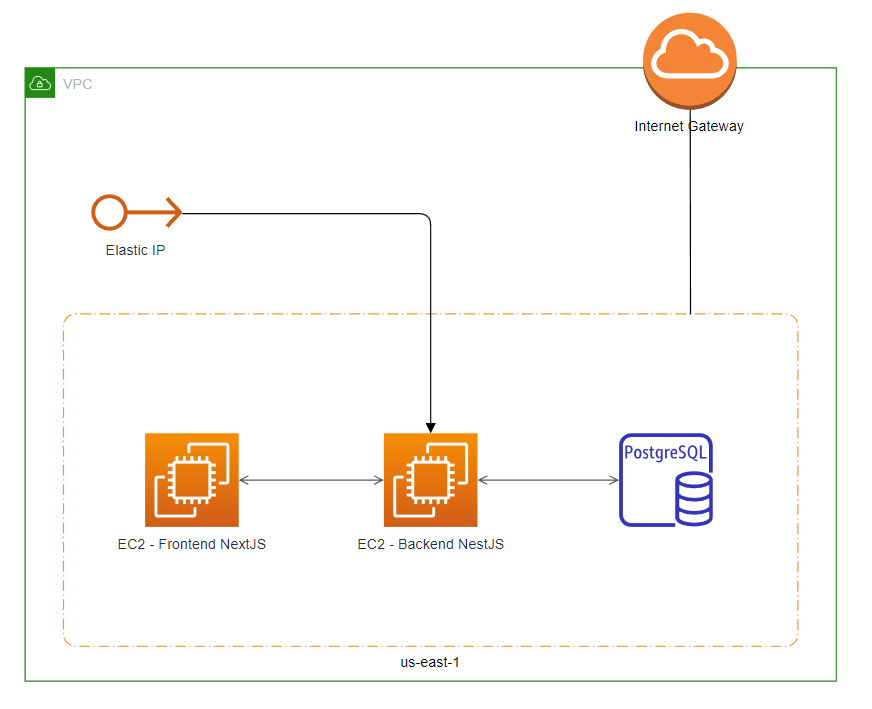

# MVP com deploy da aplicação com arquitetura simples

## Arquitetura inicial da solução

Para o desenvolvimento do MVP inicial, foi desenvolvida uma arquitetura primordial baseada em 4 elementos:

1. Instância EC2 para deploy da aplicação frontend, desenvolvida em NextJS
2. Instância EC2 para deploy da aplicação backend, desenvolvida em NestJS
3. Instância RDS PostgreSQL para gerenciamento e uso de banco de dados
4. 1x Ip elástico em conexão com a instância do backend
   O uso das linguagens e frameworks utilizados favorece a performance da aplicação, além de permitir um processo de desenvolvimento enxuto e robusto.
   Os testes de requisição foram executados via Postman, para garantir o funcionamento do serviço de rotas. Logo após, estas rotas foram integradas ao frontend com sucesso.

## Vídeos de demonstração de funcionamento da aplicação

### Sprint 1

[Backend](./videos/backend-sprint-1.mkv)

[Frontend](./videos/frontend-sprint-1.mkv)

### Sprint 2

[Backend](./videos/backend-sprint-2.mp4)

[Frontend](./videos/frontend-sprint-2.mkv)
