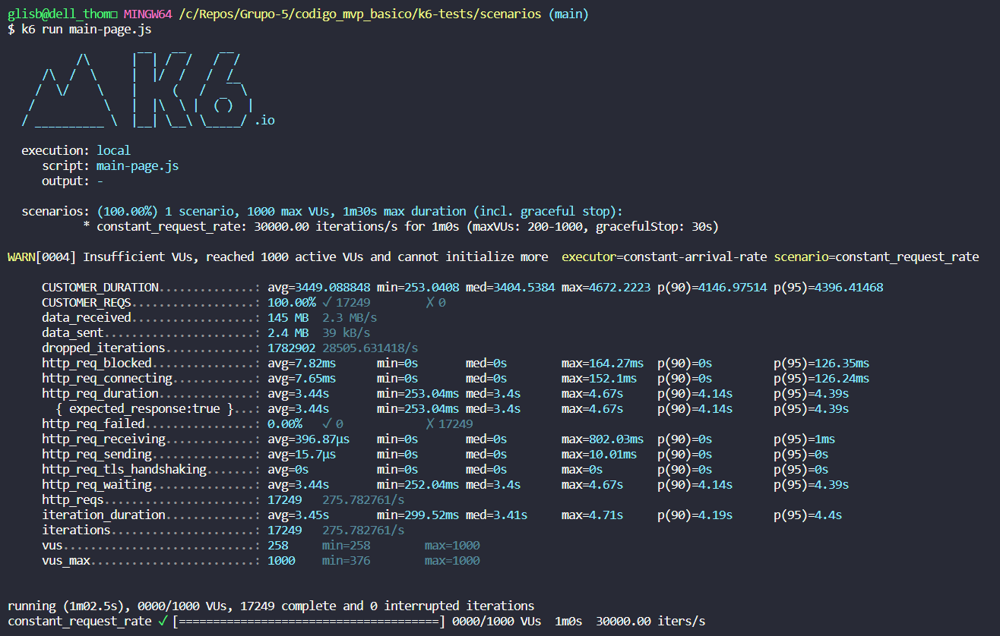
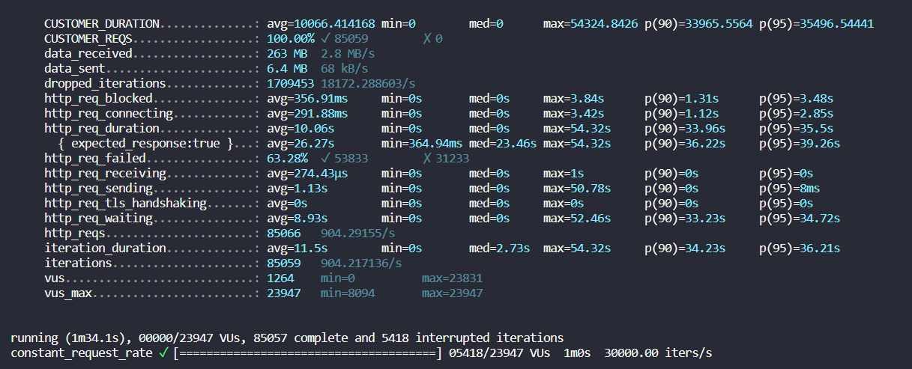
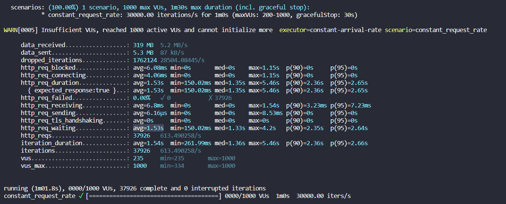
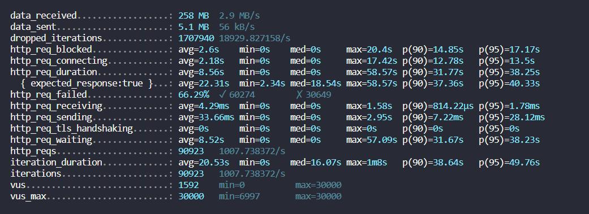
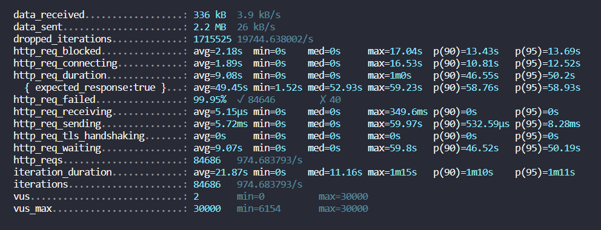
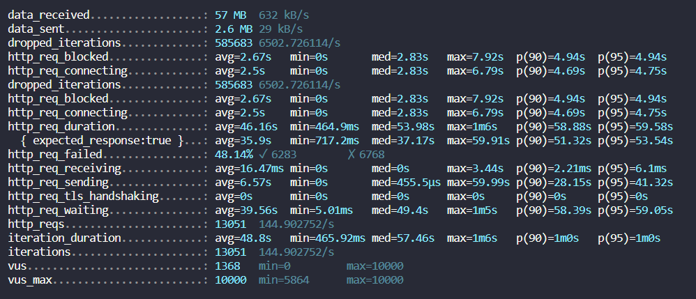

# Relatório Técnico

## Testes de carga

Para realização dos testes de carga, foi utilizada a ferramenta [K6](https://k6.io/docs/), do Grafana. Com ela, é possível criar scripts para testar endpoints específicos de back e frontend de uma aplicação.

A seguir, são explicados alguns conceitos úteis para o entendimento das especificações dos testes de carga:

- `rate`: meta de requisições a serem alcançadas no teste;
- `timeUnit`: intervalo de tempo em que o rate deve ser alcançado;
- `duration`: duração total em que o teste será rodado;
- `preAllocatedVUs`: número de usuários virtuais que estarão prontos ao iniciar o teste;
- `maxVUs`: número máximo de usuários virtuais que podem ser criados em um teste;

Essas especificações são inseridas nos scripts em constantes chamadas `options`, como no modelo a seguir:
```javascript
export const options = {
  scenarios: {
    constant_request_rate: {
      executor: "constant-arrival-rate",
      rate: 1,
      timeUnit: "1s",
      duration: "60s",
      preAllocatedVUs: 10,
      maxVUs: 100,
    },
  },
};
```
Como um dos requisitos não funcionais do sistema é suportar 30 mil requisições por segundo, todos os testes utilizarão `rate` de 30 mil e `timeUnit` de um segundo para atender à demanda especificada.

## Testes de carga executados

| Informações | Detalhamento |
| --- | --- |
| Identificação única | **load-test-001** |
| Especificações | ```rate: 30000, timeUnit: "1s", duration: "60s", preAllocatedVUs: 200, maxVUs: 1000 ```, |
| Obs | Especificações para pontapé inicial |
| Resultados |  |
| Análise | O teste tentou escalar o número de requisições por segundo para 30000 criando novos usuários virtuais, porém o limite especificado do número de usuários virtuais foi excedido (1000 VUs). Ao final, foram efetuadas 17.249 requisições em um período de 60 segundos, com média de 287 req/s. |

<br><br><br>

| Informações | Detalhamento |
| --- | --- |
| Identificação única | **load-test-002** |
| Especificações | ```rate: 30000, timeUnit: "1s", duration: "60s", preAllocatedVUs: 200, maxVUs: 30000 ``` |
| Obs | Aumento de `maxVUs` de 1000 para 30 mil |
| Resultados | Requisições ao frontend pararam de ser atendidas a partir de 11 mil requisições executadas. Não foi possível obter log de resultados do K6 por conta de um erro de excesso de impressões no terminal. |
| Análise | Pods do Kubernetes demoram, em média, 10 segundos para serem acionados. O número de requisições era escalado tão rapidamente que os novos pods de frontend não estavam no ar ainda para suprir a alta demanda. |

<br><br><br>

| Informações | Detalhamento |
| --- | --- |
| Identificação única | **load-test-003** |
| Especificações | ```rate: 30000, timeUnit: "1s", duration: "60s", preAllocatedVUs: 200, maxVUs: 30000 ``` |
| Obs | Do teste 002 para o teste 003 foi diminuído o tempo de criação de novos pods pelo EKS e o nível de memória e utilização de CPU necessários para ativação de novos pods foi diminuído para 70% (previamente eram 85 e ). Além disso, 4 pods já estavam ativos e rodando o frontend, quando nos testes anteriores apenas um pod estava ativo. |
| Resultados | Requisições pararam de ser atendidas por volta das 15 mil requisições dentro de um minuto. |
| Análise | Novamente, o problema está no tempo de criação de novos pods. |

<br><br><br>

| Informações | Detalhamento |
| --- | --- |
| Identificação única | **load-test-004** |
| Especificações | Mantiveram-se as mesmas especificações do `load-test-003` |
| Obs | Timeout do healthcheck alterado |
| Resultados |  |
| Análise | Sistema escalou para 6 réplicas de pods do frontend, porém, por conta do tempo de criação de novos pods, 67% das requisições não foram atendidas. |

<br><br><br>

| Informações | Detalhamento |
| --- | --- |
| Identificação única | **load-test-005** |
| Especificações | Foram utilizadas as mesmas especificações do K6 dos teste _load-test-00_ (```rate: 30000, timeUnit: "1s", duration: "60s", preAllocatedVUs: 200, maxVUs: 1000 ```)  |
| Obs | A aplicação foi migrada de uma arquitetura monolítica para arquitetura baseada em microsserviços |
| Resultados |  |
| Análise | A mudança de velocidade das requisições foi diminuída, como podemos ver comparando o tempo de requisição dos testes _load-test-005_ e _load-test-004_ através da métrica `http_req_waiting` |

<br><br><br>

| Informações | Detalhamento |
| --- | --- |
| Identificação única | **load-test-006** |
| Especificações | ```rate: 30000, timeUnit: "1s", duration: "60s", preAllocatedVUs: 30000, maxVUs: 30000 ```  |
| Obs |  |
| Resultados |  |
| Análise | Ao rodar o teste em um computador local (16gb de RAM), não foi possível sustentar todos os usuários virutais criados: `WARN[0060] Request Failed                                error="Get \"http://a08d9807d019a4b3eaf5e107c78c6ece-394010780.us-east-1.elb.amazonaws.com:3000/\": dial tcp 54.173.157.148:3000: bind: Uma operação em um soquete não pôde ser executada porque o sistema não tinha espaço suficiente no buffer ou porque uma fila estava cheia."` |

<br><br><br>

| Informações | Detalhamento |
| --- | --- |
| Identificação única | **load-test-007** |
| Especificações | ```rate: 30000, timeUnit: "1s", duration: "60s", preAllocatedVUs: 30000, maxVUs: 30000 ```  |
| Obs | Definição de limite de recursos de CPU para 100. Previamente, esse recurso não estava sendo monitorado. Teste iniciado com 2 pods. |
| Resultados |  |
| Análise | O número de pods foi escalado para 9, porém o tempo de criação de cada pod causou alto número de falhas nas requisições. | 

<br><br><br>

| Informações | Detalhamento |
| --- | --- |
| Identificação única | **load-test-008** |
| Especificações | ```rate: 10000, timeUnit: "1s", duration: "60s", preAllocatedVUs: 10000, maxVUs: 10000 ```  |
| Obs | - |
| Resultados |  |
| Análise | O número de pods foi escalado para 4, porémo tempo de criação de novos pods causou falhas em requisições. | 

## Conclusão 

Uma das conclusões que podem ser tiradas é que o tempo de criação de novos pods pode ser um impedimento para que todas as requisições sejam atendidas. Ou seja, quando as requisições começam a sobrecarregar o sistema, ele se escala para atendê-las. No entanto, enquanto o sistema está se escalando, mais requisições são geradas e nem todas conseguem ser atendidas.

Uma solução é saber como pré-configurar o sistema para ter a capacidade de atender a toda a demanda de requisições. Esse passou a ser o objetivo dos testes, porém, devido às limitações da máquina que estava rodando os testes, não foi possível medir a infraestrutura necessária. Ao rodar os testes de carga, foram especificados 30 mil usuários virtuais para simular requisições, mas a memória RAM disponível para esse tipo de teste não foi suficiente (16 GB).

Devido a esses fatores, o número de usuários virtuais e requisições foi reduzido em 1/3 para que o computador pudesse suportar a capacidade. Por falta de tempo para a realização do projeto, não foi possível estimar o número de pods necessários para executar a aplicação e atender a todas as requisições.