# Testes do Sistema

## Testes unitários

Foram executados testes do sistema para cehcagem da integridade dos serviços do backend. Como o backend inteiro segue a mesma estrutura, foi testado apenas os serviços referentes ao endpoint `/products`.

| Informação          | Detalhamento |
| ------------------- | ------------ |
| Identificação única | unit-test-001 listagem de produtos |
| Descrição           | Teste automatizado do serviço do backend referente ao `get` de todos os produtos. Teste automatizado utilizando a biblioteca Jest. |
| Passos para execução do teste | No terminal do backend, rodar o comando `npm run test:products` |
| Resultado esperado  | Ao executar o script de testes, a mensagem "tests passed" deve aparecer impresso no console de execução |
| Resultado obtido | 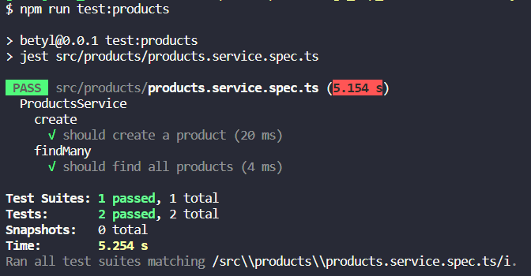 |
| Data da última execução do teste | 20.09.2023 |

## Testes de microsserviços

Para fins de aprendizagem, um microsserviço foi implementado no sistema. O restante da aplicação não foi quebrada em microsserviços por estratégia de arquitetura e deploy.

| Informação          | Detalhamento |
| ------------------- | ------------ |
| Identificação única | microsservice-test-001 microsserviço de CEP |
| Descrição           | Teste do microsserviço de CEP implementado com Python localizado na pasta [/backend/cep-service](../codigo_mvp_basico/backend/cep-service/) |
| Passos para execução do teste | Utilizar qualquer plataforma de API (como Postman ou Insomnia) para testar o endpoint do microsserviço: `<endereço_backend_da_aplicação>/cep/00000000`, substituindo os valores de `0` por um CEP real. |
| Resultado esperado  | JSON com os seguintes atributos: `cep, state, city, neighborhood, street, provider`. O CEP utilizado para teste foi `05508070`, que deve retornar o endereço do Inteli. |
| Resultado obtido | 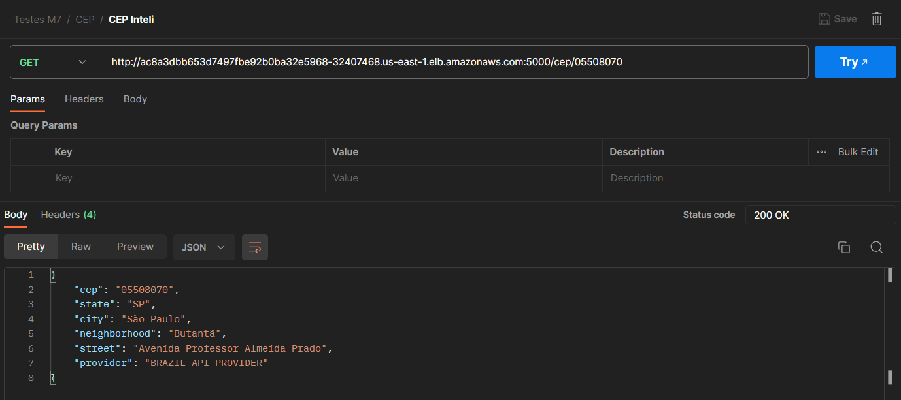 |
| Data da última execução do teste | 26.09.2023 |

## Testes de integração

Os seguintes testes estão de acordo com os casos de uso registrados no documento [modelagem.md](./modelagem.md). Como os casos tratam com o funcionamento do front e do backend, eles estão sendo tratados também como testes de integração.

| Informação          | Detalhamento |
| ------------------- | ------------ |
| Identificação única | integration-test-001 registrar usuário |
| Descrição           | Teste de integração baseado no caso de uso `Registrar Usuário` |
| Passos para execução do teste | Com o frontend já rodando, seguir o fluxo do caso de uso referente  |
| Prova de execução | 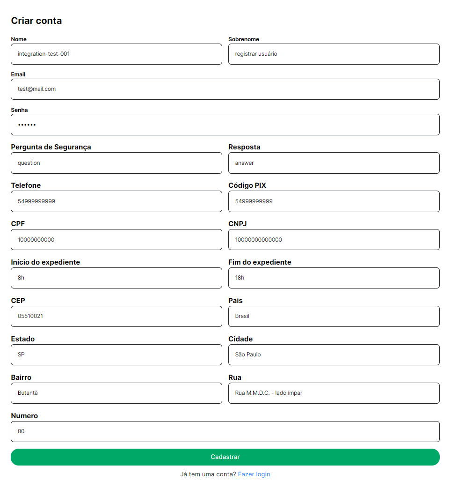 |
| Resultado esperado  | Criação do usuário feita com sucesso |
| Resultado obtido | Ao realizar o GET de todos os usuários, o usuário recém criado estava listado com sucesso: 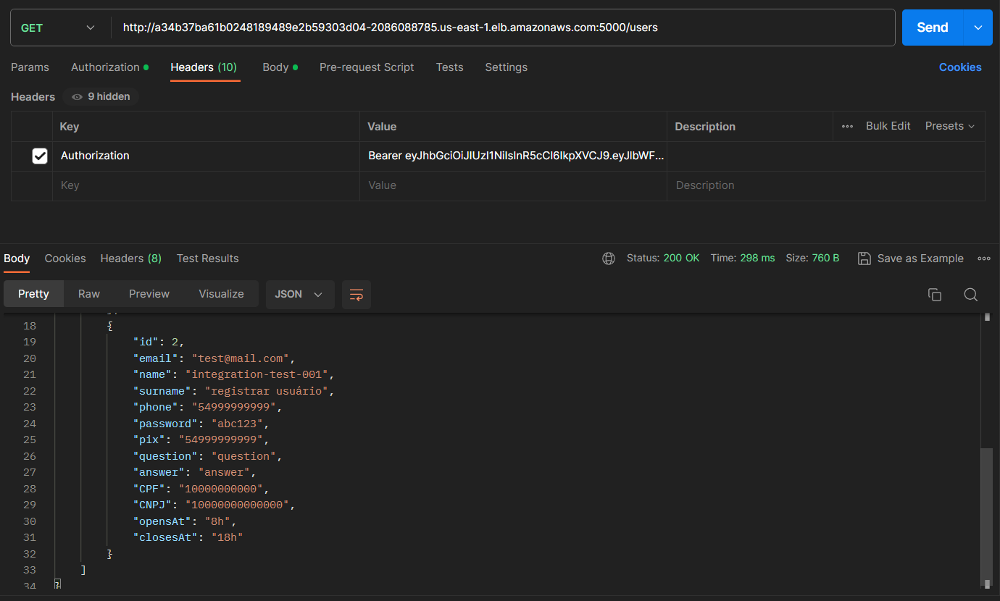 |
| Data da última execução do teste | 27.09.2023 |

   

| Informação          | Detalhamento |
| ------------------- | ------------ |
| Identificação única | integration-test-002 autenticar usuário |
| Descrição           | Teste de integração baseado no caso de uso `Autenticar usuário` |
| Passos para execução do teste | Com o frontend já rodando, seguir o fluxo do caso de uso referente |
| Prova de execução | 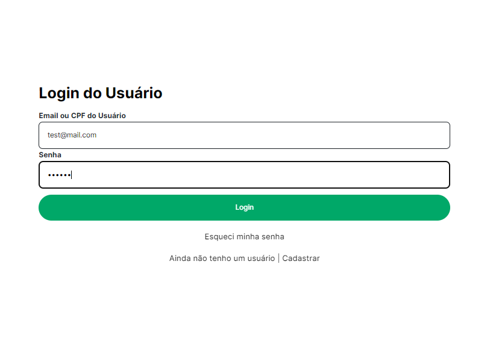 |
| Resultado esperado  | Login realizado com sucesso. Quando o usuário estiver logado, a barra superior apresenta a opção de botão `User`, com opções de `Editar informações`, `Meus pedidos` e `Logout` |
| Resultado obtido |  |
| Data da última execução do teste | 27.09.2023 |

   

| Informação          | Detalhamento |
| ------------------- | ------------ |
| Identificação única | integration-test-003 navegar por produtos |
| Descrição           | Teste de integração baseado no caso de uso `Navegar por Produtos` |
| Passos para execução do teste | Com o frontend já rodando, seguir o fluxo do caso de uso referente |
| Prova de execução | 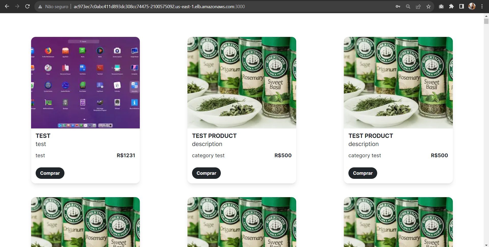 |
| Resultado esperado  | Listagem de produtos na tela inicial |
| Resultado obtido | Sucesso na listagem de produtos ao acessar a tela inicial (como mostrado na imagem da prova de execução) |
| Data da última execução do teste | 27.09.2023 |

   

| Informação          | Detalhamento |
| ------------------- | ------------ |
| Identificação única | integration-test-004 efetuar compra |
| Descrição           | Teste de integração baseado no caso de uso `Efetuar Compra` |
| Passos para execução do teste | Com o frontend já rodando, seguir o fluxo do caso de uso referente |
| Prova de execução | 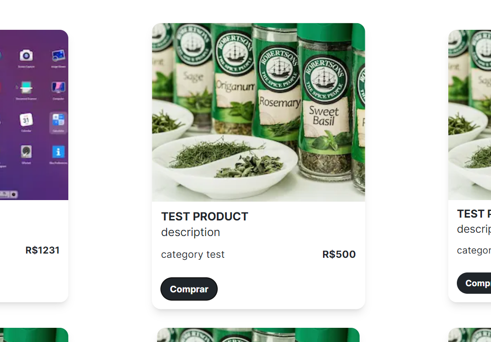 |
| Resultado esperado  | Ao finalizar a compra, um alerta será mostrado na tela com a informação `Produto comprado com sucesso!` |
| Resultado obtido | Sucesso na compra: 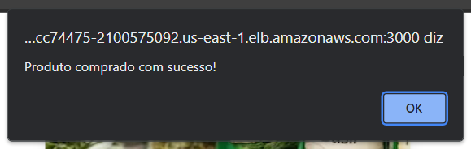 |
| Data da última execução do teste | 27.09.2023 |

   

| Informação          | Detalhamento |
| ------------------- | ------------ |
| Identificação única | integration-test-005 rastrear pedido |
| Descrição           | Teste de integração baseado no caso de uso `Rastrear Pedido` |
| Passos para execução do teste | Com o frontend já rodando, seguir o fluxo do caso de uso referente |
| Prova de execução | 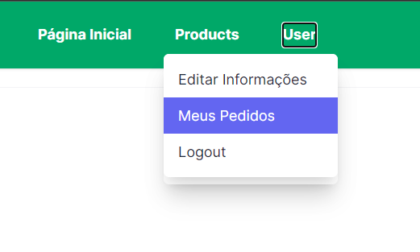 |
| Resultado esperado  | Listagem de pedidos efetuados |
| Resultado obtido | Sucesso na listagem: 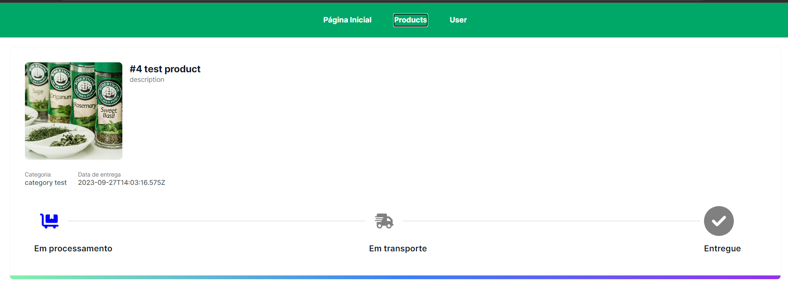 |
| Data da última execução do teste | 27.09.2023 |

   

| Informação          | Detalhamento |
| ------------------- | ------------ |
| Identificação única | integration-test-006 cadastrar produto |
| Descrição           | Teste de integração baseado no caso de uso `Cadastrar Produto` |
| Passos para execução do teste | Com o frontend já rodando, seguir o fluxo do caso de uso referente |
| Prova de execução | 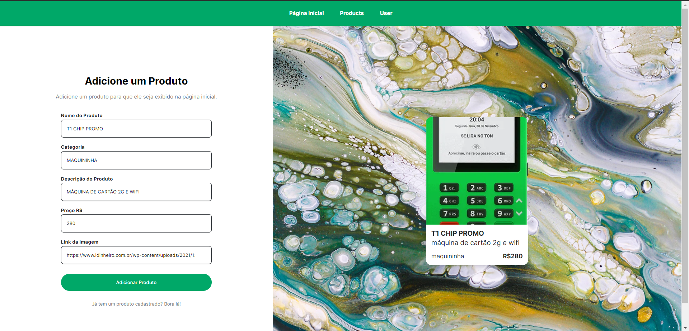 |
| Resultado esperado  | Sucesso ao cadastrar produto novo |
| Resultado obtido | Sucesso ao cadastrar produto novo 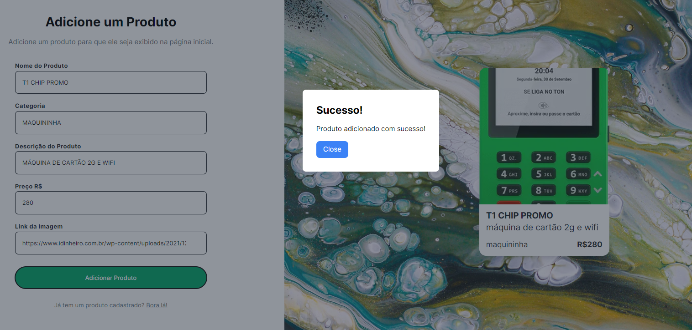 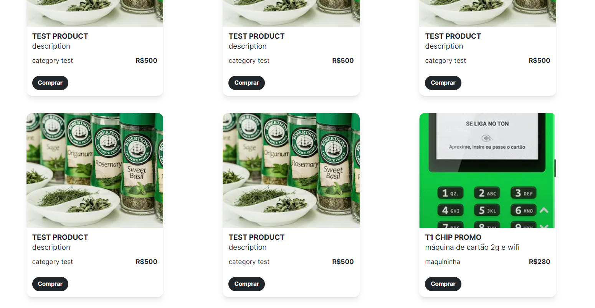 |
| Data da última execução do teste | 27.09.2023 |

   

| Informação          | Detalhamento |
| ------------------- | ------------ |
| Identificação única | integration-test-007 editar produto |
| Descrição           | Teste de integração baseado no caso de uso `Editar Produto` |
| Passos para execução do teste | Com o frontend já rodando, seguir o fluxo do caso de uso referente |
| Prova de execução | 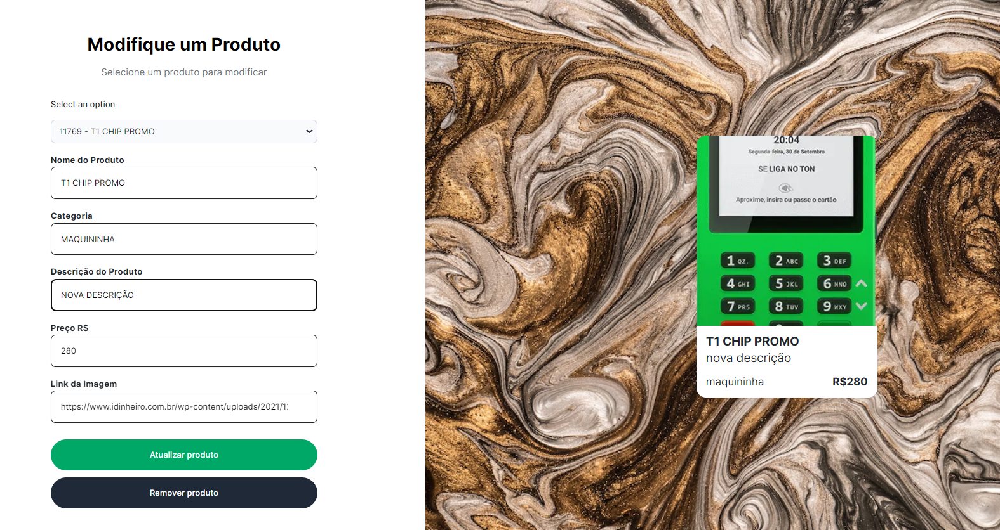 |
| Resultado esperado  | Sucesso na edição de informações do produto |
| Resultado obtido | Sucesso na edição 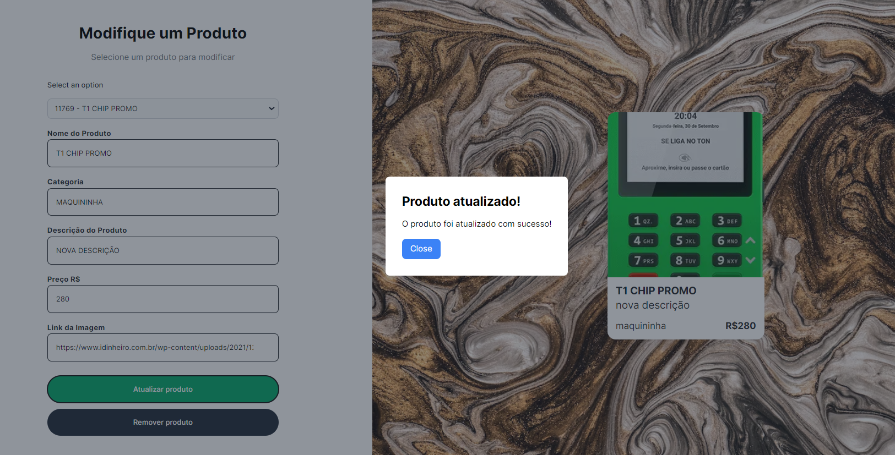  |
| Data da última execução do teste | 27.09.2023 |

   

| Informação          | Detalhamento |
| ------------------- | ------------ |
| Identificação única | integration-test-008 remover produto |
| Descrição           | Teste de integração baseado no caso de uso `Remover Produto` |
| Passos para execução do teste | Com o frontend já rodando, seguir o fluxo do caso de uso referente |
| Prova de execução | 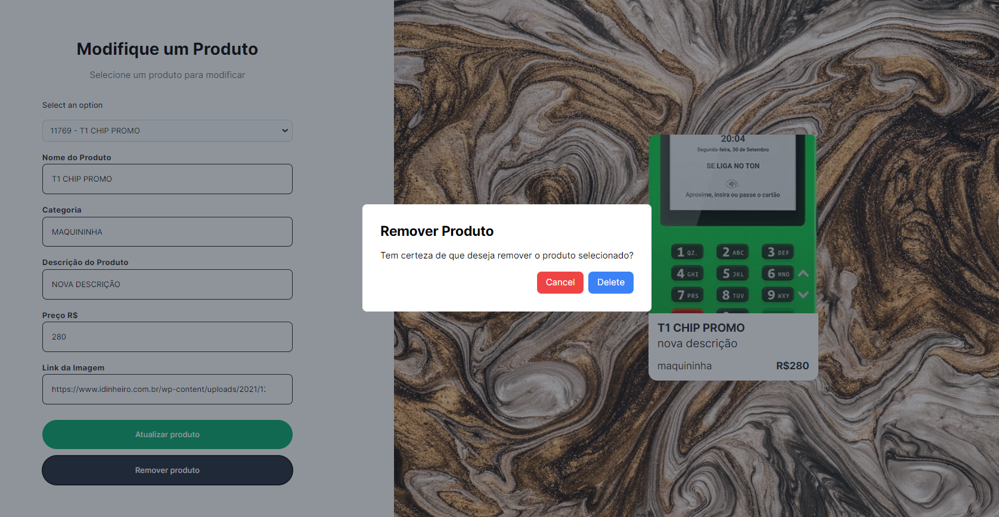 |
| Resultado esperado  | Alerta na tela com a mensagem `Produto removido!` |
| Resultado obtido | Sucesso ao remover produto 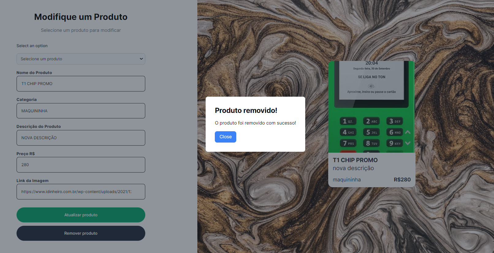 |
| Data da última execução do teste | 27.09.2023 |